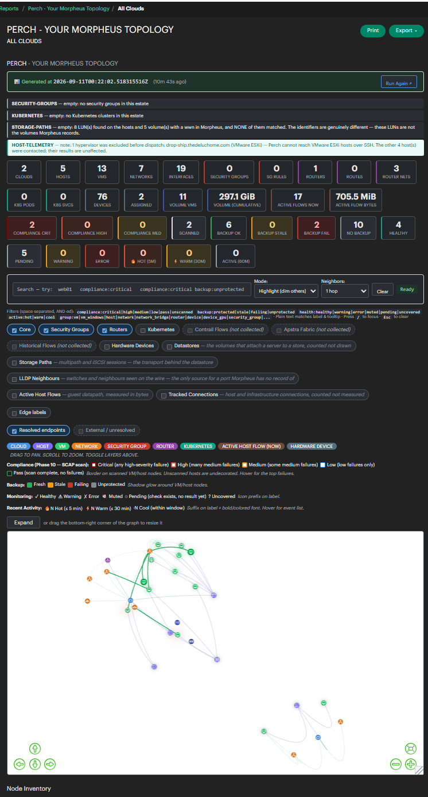
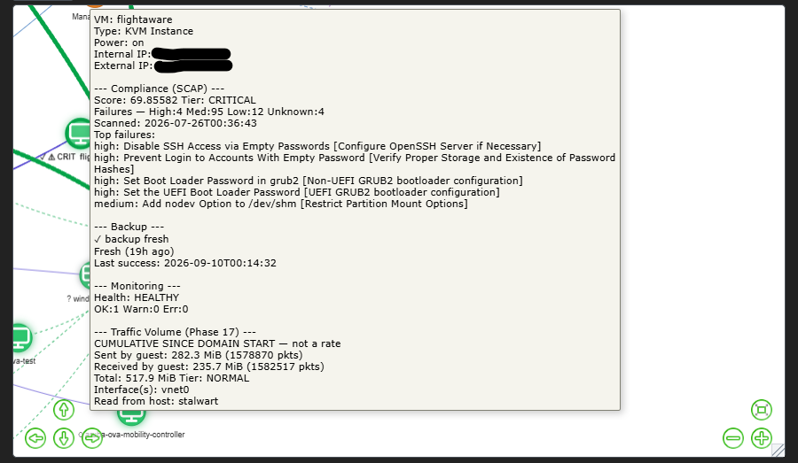
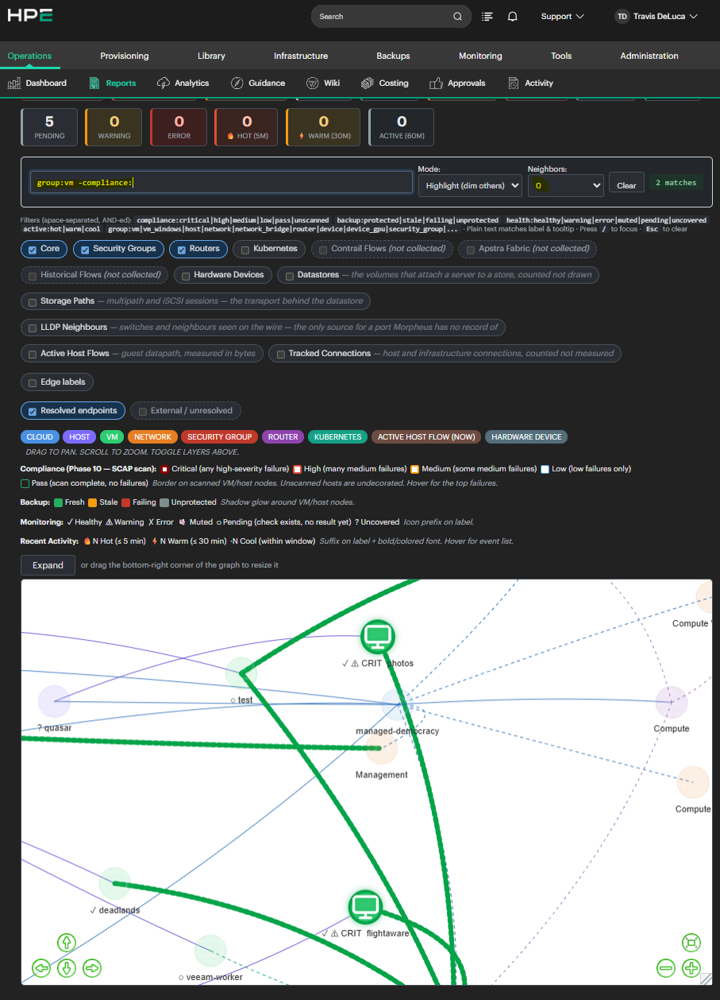
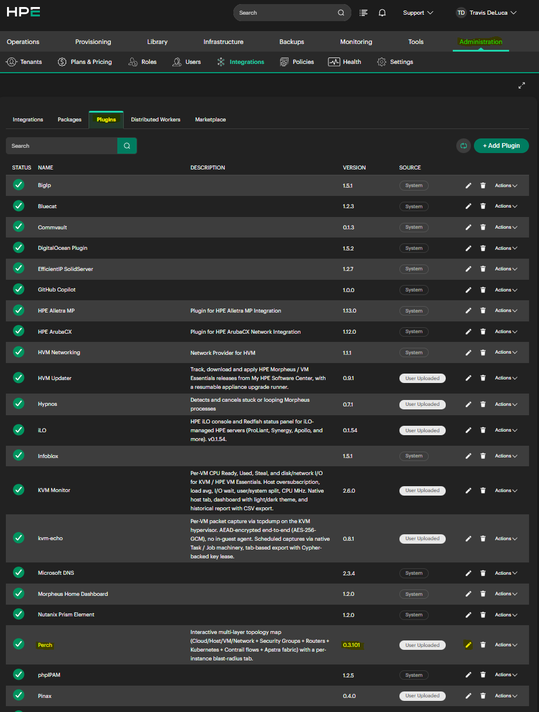
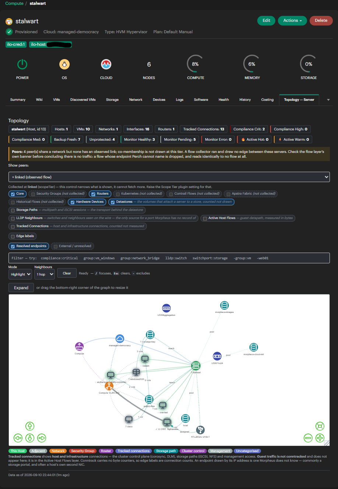
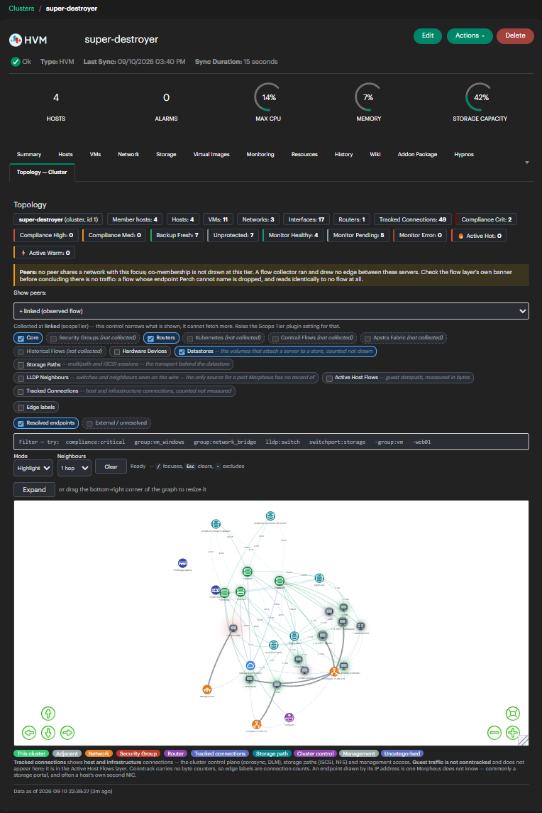
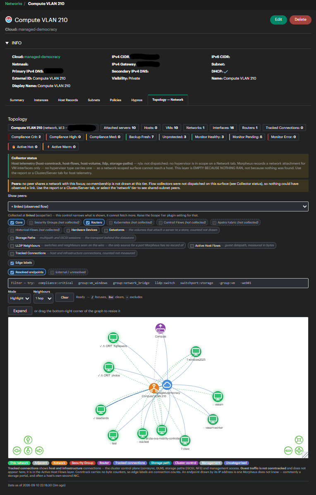

<div align="center">


# Perch

**Read-only topology for HPE Morpheus and VM Essentials, Advanced, Enterprise.**


</div>

---

Perch draws your estate as one interactive graph — cloud → host → VM → network,
with operational overlays for compliance, backup, monitoring and recent activity
on top. It rides entirely on data Morpheus has already synced: **no agents of its
own, no inventory of its own, and no calls outside your appliance unless you
switch them on.**

It is read-only in the strict sense. Perch never writes to Morpheus, never
provisions, and never changes a host. Uninstalling it removes everything it was.

<!-- SCREENSHOT report-overview.png: Operations > Reports > Perch, default layers, whole graph in frame, inventory tables just visible below -->


---

## What it shows

Every layer is labelled with where its data comes from, because that is what
determines its cost. **Everything that leaves the Morpheus database is off by
default.**

| Layer | Source | Default | Surfaces |
|---|---|---|---|
| Core — clouds, hosts, VMs, networks | Local SQL | **on** | all |
| Routers | Local SQL | **on** | all |
| Security groups + rules | Local SQL | **on** | all |
| Kubernetes pods + services | Local SQL | **on** | all |
| Compliance overlay | Local SQL | **on** | all |
| Backup overlay | Local SQL | **on** | all |
| Monitoring overlay | Local SQL | **on** | all |
| Recent activity overlay | Local SQL | **on** | all |
| Datastores + volumes | Local SQL | off | all |
| Hardware devices (GPU passthrough) | Local SQL | off | all |
| Host traffic volume | **SSH** | off | report, instance, server, cluster |
| Active host flows | **SSH** | off | report, instance, server, cluster |
| Tracked connections | **SSH** | off | report, instance, server, cluster |
| Storage paths (multipath / iSCSI) | **SSH** | off | report, instance, server, cluster |
| LLDP neighbours | **SSH** + `lldpd` | off | report, instance, server, cluster |
| Contrail flows / Apstra fabric / flow replay | **External REST** | off | all |

The four surfaces beyond the report are **Topology tabs** on instance, server,
cluster and network detail pages, each scoped to what that object touches.

<!-- SCREENSHOT report-overlays.png: report with compliance + backup + monitoring overlays lit, so borders, glows and health icons are all visible at once -->


<!-- SCREENSHOT report-search.png: a compound DSL query in highlight mode, e.g. "group:vm -compliance:pass", with the match counter visible -->


---

## Does it work on my stack?

**The database layers should work on any Morpheus 9.0.1+.** They read tables
Morpheus itself populates.

**The host-telemetry layers need libvirt and Open vSwitch.** On VMware, Nutanix,
Hyper-V or Linux-bridge KVM they cannot work as built — and Perch says so
explicitly rather than rendering an empty layer.

**Verified against exactly one environment:** one Morpheus 9.0 appliance, one
private cloud, four KVM/MVM hypervisors on Open vSwitch, roughly a dozen servers
and a handful of networks.

That is the honest scope. Every threshold, every default, every type-code mapping
that picks an icon was chosen by looking at that estate. **When something looks
wrong on yours, the first question is usually "is this a fault, or is my estate
simply not the one this was tuned against?"** — see
[LIMITATIONS.md](LIMITATIONS.md) and [docs/SCHEMA.md](docs/SCHEMA.md).

A second cloud type — a standalone VMware ESXi host — has been handled as
designed but **not yet verified against a live ESXi cloud.**

---

## Install

```bash
sha256sum -c perch-morpheus-plugin-<version>.jar.sha256
```

**Administration → Integrations → Plugins → Upload**, select the jar, done. No
appliance restart, no service to bounce.

Full instructions, plugin settings, sudoers and `lldpd` setup:
**[INSTALL.md](INSTALL.md)**.

<!-- SCREENSHOT install-upload.png: Administration > Integrations > Plugins with Perch listed and enabled, version visible -->


---

## Before you deploy

**Perch does not filter by tenant.** It reads the Morpheus database directly,
through a connection that performs no tenant evaluation, so it does not inherit
Morpheus RBAC. Any user who can open a Perch surface sees the whole estate that
surface returns.

`getMasterOnly()` is the only control. **If you run sub-tenants, read
[SECURITY.md](SECURITY.md) first.**

---

## Tell us how it went

Perch has been verified on one estate, so **a report that it worked on yours is
as useful as a bug** — it is the only way the "verified on" list above ever
grows.

Five questions, and one-line answers are plenty:

1. **Hypervisor / cloud type** — VMware, Nutanix, Hyper-V, KVM, AWS, Azure, mixed?
2. **Scale** — how many servers, networks, clouds?
3. **Multi-tenant?** Perch does not filter by tenant; if you run sub-tenants, say so.
4. **Which layers were empty**, and did you expect data there?
5. **Anything that looked wrong but did not error** — a wrong count, an odd
   glyph, a node in the wrong table. Silent wrongness is the most valuable thing
   to receive and the hardest to find from logs.

→ **[Open an "it worked" issue](../../issues/new?template=it-worked.yml)**, or see
[FEEDBACK.md](FEEDBACK.md) for what to send and how to send it without publishing
your infrastructure.

---

## Documentation

| | |
|---|---|
| [INSTALL.md](INSTALL.md) | Install, settings, privileges, `lldpd`, SCAP |
| [LIMITATIONS.md](LIMITATIONS.md) | What it cannot do, and why |
| [SECURITY.md](SECURITY.md) | Tenancy, what is never read, reporting a vulnerability |
| [docs/ARCHITECTURE.md](docs/ARCHITECTURE.md) | How it works and what it costs |
| [docs/SCHEMA.md](docs/SCHEMA.md) | What it reads — for filing schema-difference issues |
| [docs/CONFIGURATION.md](docs/CONFIGURATION.md) | Every setting and run option |
| [docs/DIAGNOSTICS.md](docs/DIAGNOSTICS.md) | What to collect when something is wrong |
| [docs/TROUBLESHOOTING.md](docs/TROUBLESHOOTING.md) | Symptom → cause → which diagnostic |
| [CHANGELOG.md](CHANGELOG.md) | What changed, per release |

---

## The surfaces

<!-- SCREENSHOT surface-server.png: Server tab on a hypervisor, guests fanned out beneath it -->


<!-- SCREENSHOT surface-cluster.png: Cluster tab showing switch fan-in with port labels on the edges -->


<!-- SCREENSHOT surface-network.png: Network tab with the collector banner visible, explaining why host telemetry is empty there -->


---

## Licence

Apache 2.0 — see [LICENSE](LICENSE) and [NOTICE](NOTICE). Perch is a community
plugin. It is **not** an HPE or Morpheus product and carries no support from
either.
